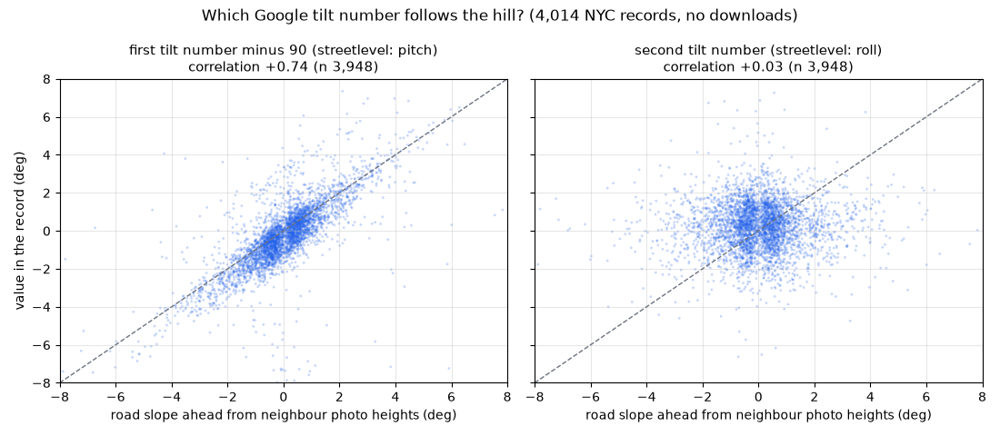
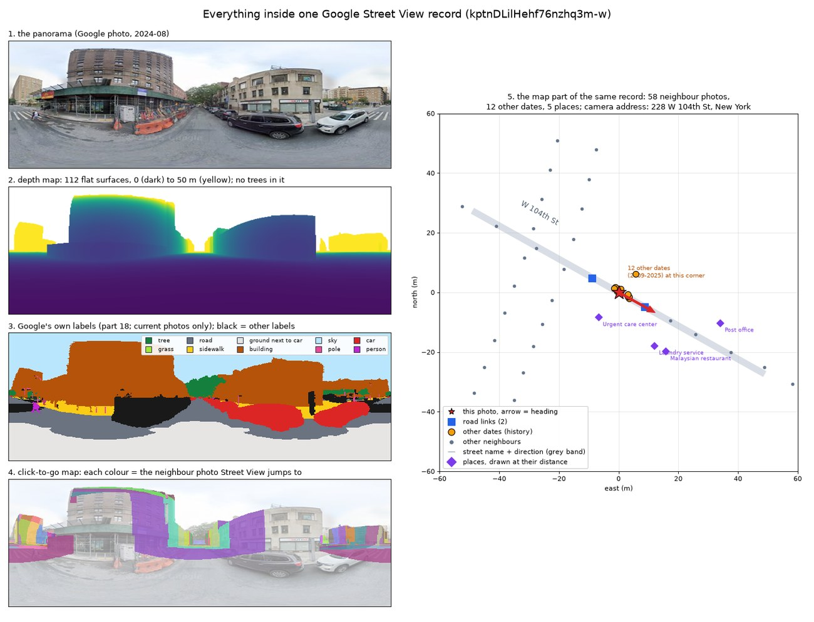
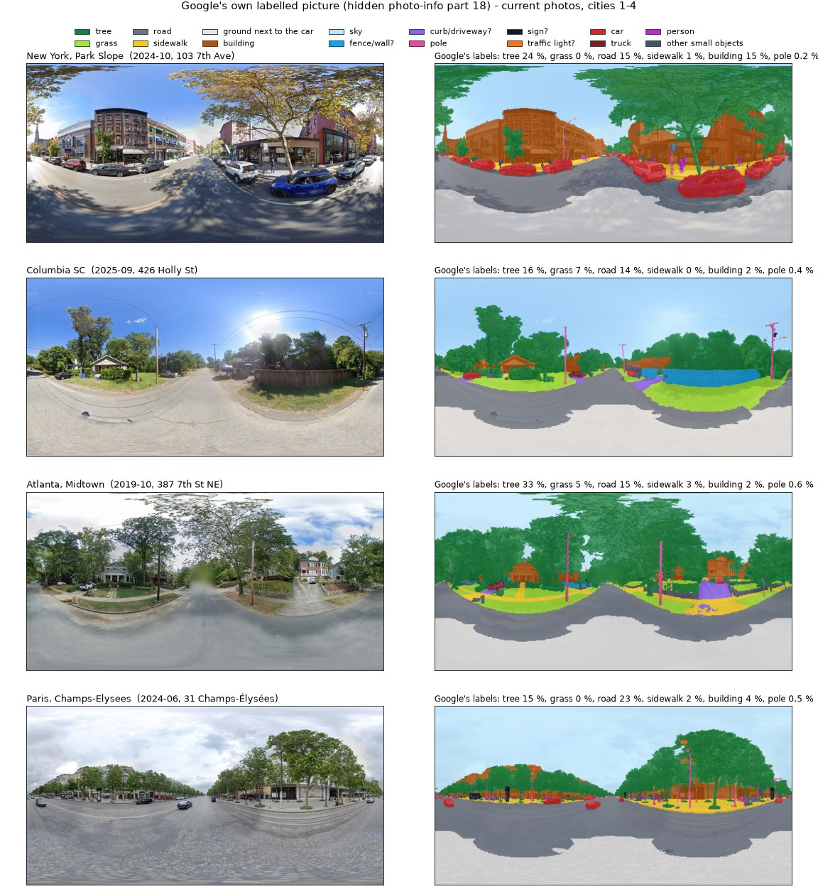
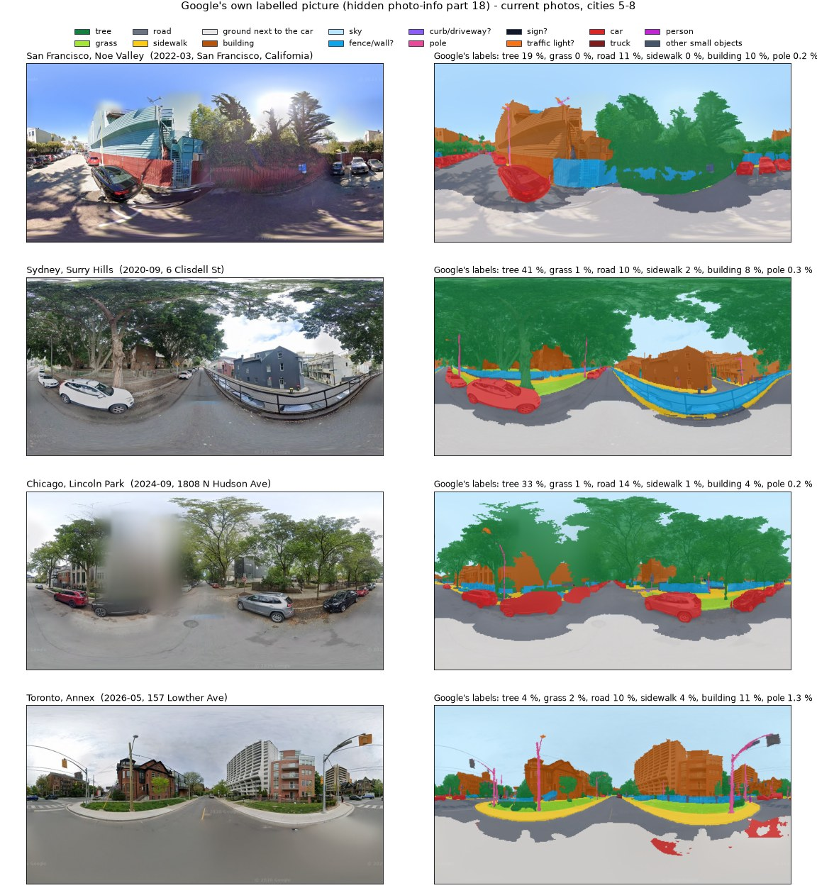
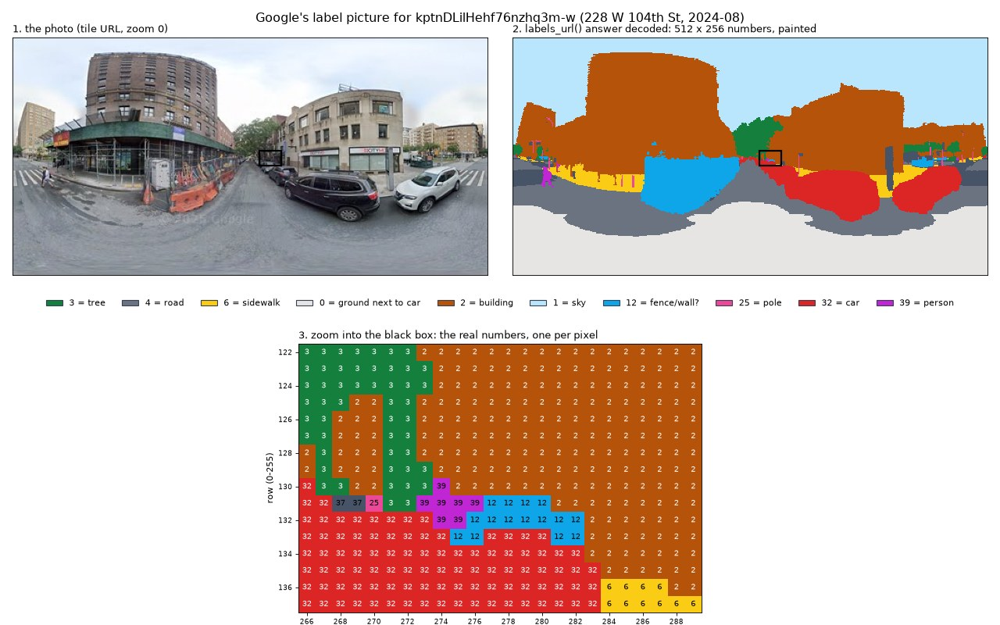
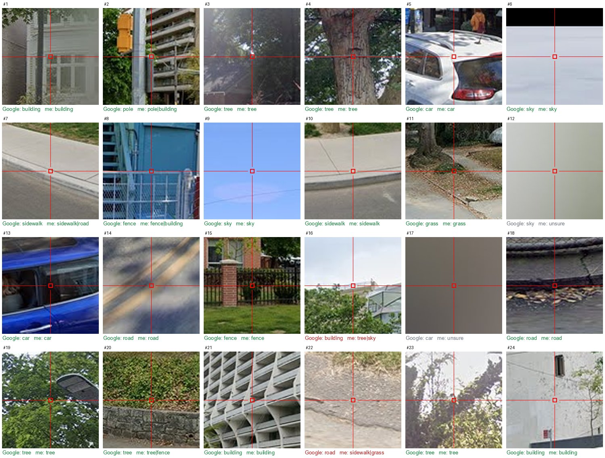
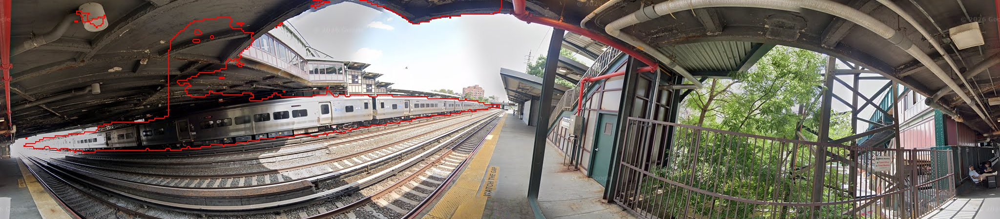
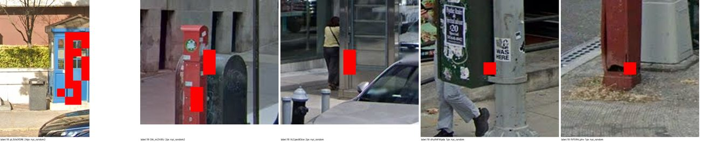
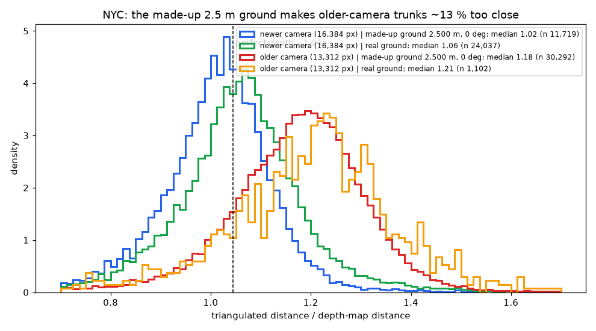
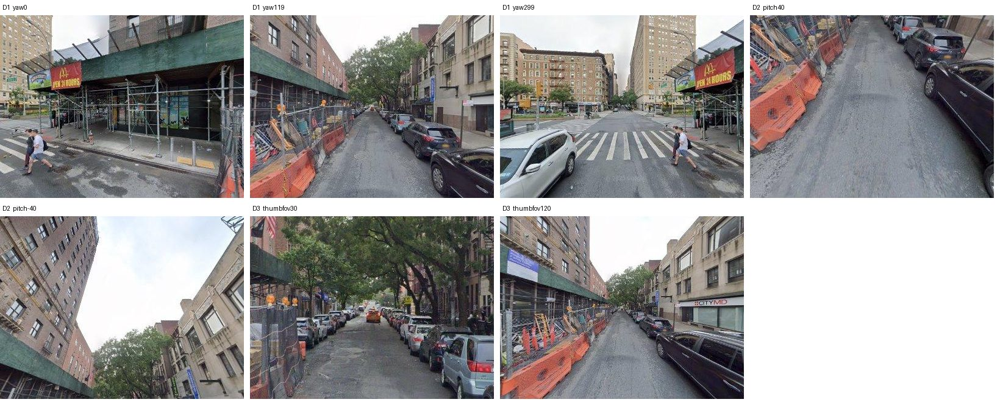

# What Google Street View really sends: findings of 2026-09-29

A one-day study of the requests SIM makes to Google Street View and of the
answers it gets back.

- The clean reference (every URL setting and answer field, by name) is
  [GSV_API_REFERENCE.md](GSV_API_REFERENCE.md). This file summarises how
  it was found out and what was learned.
- The work was done for a street-tree inventory in New York City, so most
  numbers are from NYC.
- All requests were spaced about 1-1.5 s apart. Google's scrambled map-tile
  format was deliberately left alone.

## 1. How the requests were studied

1. **Watching the browser.**
   - Chrome was driven by a script (Playwright): headless, with a new empty
     profile and the GPU off.
   - It opened a Street View page, as the F12 "Network" tab would, and saved
     every request.
   - Google answers a browser that calls itself "HeadlessChrome" with empty
     records, so the normal Chrome name was used.
2. **Reading the `pb=` text.**
   - Google's request strings (`!1m4!1smaps_sv.tactile!...`) are a nested
     record flattened into pieces `!<field><type><value>`.
   - `gsv_pano/gsv_pb.py` turns them into a tree and back. All 18 captured
     strings convert back exactly.
3. **Changing one part at a time.** SIM's photo-info request was rebuilt from
   named parts, then sent again with one part removed or added (about 60
   requests). Each changed part was compared with the normal answer.
4. **Checking the meaning against real data:**
   - 4,014 stored NYC answers;
   - 519 label pictures;
   - 120 points judged blind by eye;
   - 600 published tree trunks;
   - a few hundred small image tiles.

## 2. Findings

### 2.1 SIM already gets everything Google's own page gets

- Google's Street View page sends the same photo-info request as SIM, plus
  two extras (part 4.1 = 17 and part 4.11.3.4). They add nothing.
- The two answers for the same photo are identical, apart from the order of
  nearby places and one status number (`m[0][0]`: 1 for SIM's request, 3
  for the page's).
- SIM's language `zh-CN` only changes which nearby places are listed. The
  language of addresses and street names comes from `hl=` in the URL.

### 2.2 The two "tilt" numbers are pitch + 90 and roll

- The answer holds `[heading, A, B]`. SIM stores A as `tilt_yaw_deg` and B as
  `tilt_pitch_deg`.
- A car's pitch follows the slope of the road. We took the road slope from
  the heights of neighbouring photos 4-25 m ahead, in the same answer.
- **A - 90 follows the slope** (r = +0.74, slope 0.77); **B does not**
  (r = +0.03).
- So A - 90 is the pitch and B is the roll. SIM's rotation code already uses
  them this way; only the names mislead, and comments now say so.

### 2.3 The "second depth map" is Street View's click-to-go map

`m5[5]` carries two pictures. The first is the plane depth map SIM uses. The
second (request part 4.6) is **not depth**: for each pixel it names the
neighbouring photo that Street View jumps to when you click there.

- **Kind 1** (what SIM downloads): numbers into the record's neighbour list.
  All pixels agreed with kind 2.
- **Kind 2**: the same map plus a table of photo ids and flat offsets in
  metres. Their lengths equal the true distances within 0.5 m.
- SIM's `compressJson()` deletes this map. **Leaving part 4.6 out of the
  request would save 23 % of every download.**
- It can pick close-ups. At the base of 600 published tree trunks, the photo
  it names was closer to the tree than the camera in 95 % of cases (median
  6.1 m vs 9.5 m).

*The parts of one answer (228 W 104th St, 2024-08): panorama, depth map,
Google's labels, click-to-go map, and the map part (neighbours, history,
places, street direction).*

### 2.4 Google sends a per-pixel label picture if asked (part 18)

Adding `!1e18` to the request list makes the answer carry `m[20]`, a
**512 x 256 WebP picture with one label number per pixel**: road, building,
tree, pole, car, person and so on. Neither SIM nor Google's page asks for it.
The shortest request (part 18 alone) returns about 4 KB.

**Resolution.** 0.70 degrees per pixel (12 cm at 10 m). A 30 cm trunk at
10 m covers about 2.4 label pixels. It is a real 512 x 256 picture, not a
smaller one enlarged.

**Which photos have it.** Mostly the photo Google currently shows at a spot:

| Photos | With labels |
|---|---|
| current NYC photos from 2022 on | **85 %** (434 of 508) |
| current NYC photos from 2019-2021 | **27 %** (22 of 82) |
| older history photos | rarely |

Outside NYC, the current photo had labels in Columbia SC, Atlanta, San
Francisco, Chicago, Toronto, Miami Beach, Paris, Amsterdam and Sydney. It had
none in London (a 2017 photo) or Tokyo.

**Accuracy.** 120 points were read blind by eye (without Google's label)
on 2048 px crops:

- **86 %** agreement, 90 % when a point on an edge may count for either side;
- sky, car and fence were best;
- grass was weakest (7/10);
- at 24 published NYC tree trunks, "tree" was the main label at 17 and among
  the top 3 at 23.

**Numbering.** There are 44 numbers, 0 to 43, all named. The table is in
the reference, section 6.3.

- Tree (3) covers canopy **and trunk**.
- 0 is the ground right next to the car.
- The list is **not ADE20K**, not Cityscapes and not Mapillary Vistas.
  Mapillary Vistas is closest in content: about 34 of the 44 have a match,
  with several Vistas classes merged.

*Blind check: Google's label and our reading under each crop. Green =
agree, orange = agree when an edge may count for either side, red =
disagree, grey = could not read.*

Rare numbers were named from the full-resolution panorama. For example, 35
is a train (a Long Island Rail Road train at Woodside) and 18 is a
fire-alarm call box:

### 2.5 The depth map's ground is often made up (confirms the README note)

Many depth maps put a **perfectly level plane exactly 2.500 m** below the
camera (plane distance 2.5000, tilt 0.000). Google's answer has no tag that
says so, but the signature is exact:

| Camera | Panoramas with the 2.5 m / 0 deg plane |
|---|---|
| older, 13,312 px (2009-2017 photos) | **95.4 %** of 2.25 M NYC panoramas |
| newer, 16,384 px | 25.8 % of 4.09 M |

**Check against geometry that needs no depth map.** We compared the trunk
distance from triangulation with the distance read from the depth map. With
perfect depth the ratio is about 1.045:

| Camera | Ground | Median ratio |
|---|---|---|
| older | made-up 2.5 m | **1.18**, as if the camera were 2.83 m high |
| newer | made-up 2.5 m | 1.02 |
| newer | real ground | 1.06 |

So for the older camera the made-up plane puts ground objects about 13 %
too close. For the newer camera it is about right (its camera is about
2.4 m high).

The same NYC panoramas were compared with the depth maps of a 2021
inventory:

- the older camera's ground changed from a real sloped plane (about 2.92 m)
  to the made-up 2.500 m;
- walls did not change (median distance x1.01).

### 2.6 About 1 % more photos hide in the neighbour list

The neighbour list `m5[3][0]` holds 45-133 photos, far more than `Links` and
`Time_machine`.

- In 300 answers it named 22,808 photos. 221 (1.0 %) were missing from a
  city-wide NYC crawl that followed every road link and history list.
- Those checked were older-camera photos from 2010-2013 with status
  (1,1,1): no address and no history list of their own.

### 2.7 Photo spheres uploaded by the public open with type 10

- Ids starting `CIHM0og...` or `CIABIh...` appear in neighbour and history
  lists with type 10.
- With SIM's type 2 Google returns an empty answer. With type 10 they open
  fully.
- They have low resolution (for example 7,744 px wide), no labels, and
  sometimes no elevation or heading. That missing value is what broke SIM's
  `getTimeMachine()` (section 3).

### 2.8 URL settings, in short

Details are in the reference, section 4.

- `hl=` sets the language of addresses and street names.
- The search radius `!2d50` is a hard limit in metres.
- Tile and flat-view addresses need `cb_client=maps_sv.tactile` (403
  without it).
- `nbt=1` gives an error instead of a black tile outside the picture.
- Flat views (`getImagefrmAngle()`):
  - `yaw` is a compass direction;
  - **positive `pitch` looks down**;
  - sizes are capped at 1024 x 768.

### 2.9 Other things in the answer SIM does not read

- the camera's **house address** (100 %);
- **street names with road directions** (96 %; 2 or more at crossings);
- **nearby places** (33 %) with Google Maps feature ids, sometimes with a
  distance;
- the **ellipsoid height** (now read, see section 3);
- the **capture day** (for very few dates);
- **indoor floor levels**;
- a **status code**: (3,4,1) normal, (3,2,1) no history, (1,1,1) unlinked
  older photo.

## 3. Bugs found in SIM and fixed

Eight bugs were fixed with minimal changes. Each is marked
`# Fix (2026-09-29)` in the code and covered by a test that fails on the
old code.

The one that lost real data:

- `getTimeMachine()` stopped at the first history entry without elevation
  or heading, usually a public photo sphere.
- This happened in 6 of 3,000 NYC answers, and in one of them a **2024
  Google photo was lost**.

The other seven are latent crashes or wrong log messages. The full list is
in the reference, section 10.

On 3,000 real answers the fixed code gives exactly the old output, except
for two things: `elevation_wgs84_m` is now filled, and the lost history
dates come back.

## 4. Limits and open questions

- These are undocumented Google requests and can change at any time.
- Still unknown: `fover`; part 4.9 (photo-type filters, no visible effect);
  4.1 = 4; the rule of search part 3.9.1; `gl=`; the `m[12]` flag; and one
  11-character code on places.
- The label picture is too coarse for measuring sizes. It exists mostly
  for photos from 2022 on, and Google does not say which model made it.
- The label names come from looking at outlined examples. Numbers seen in
  few photos (18, 35, 43) rest on fewer examples, and 43 (overhead wires) is
  only "likely".
